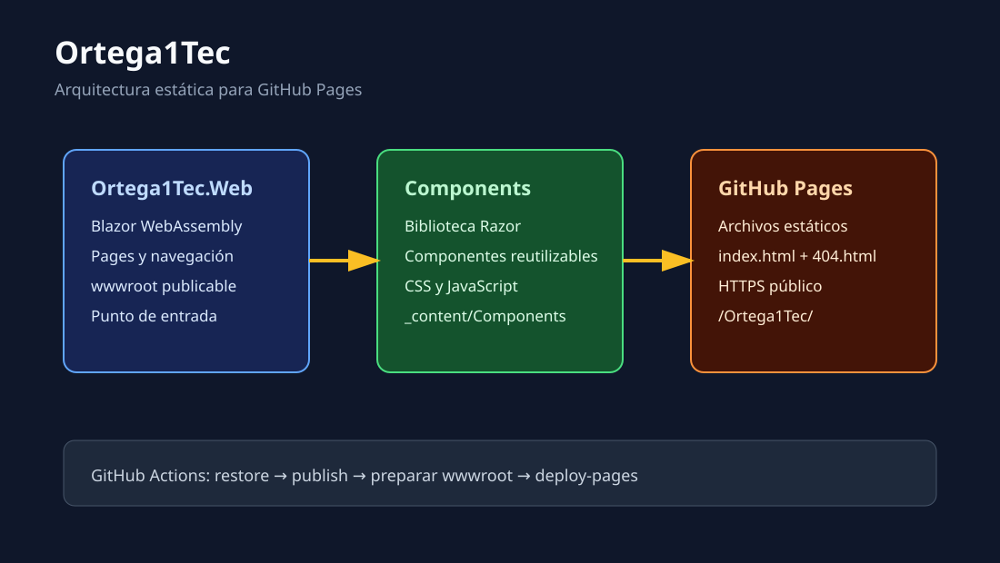
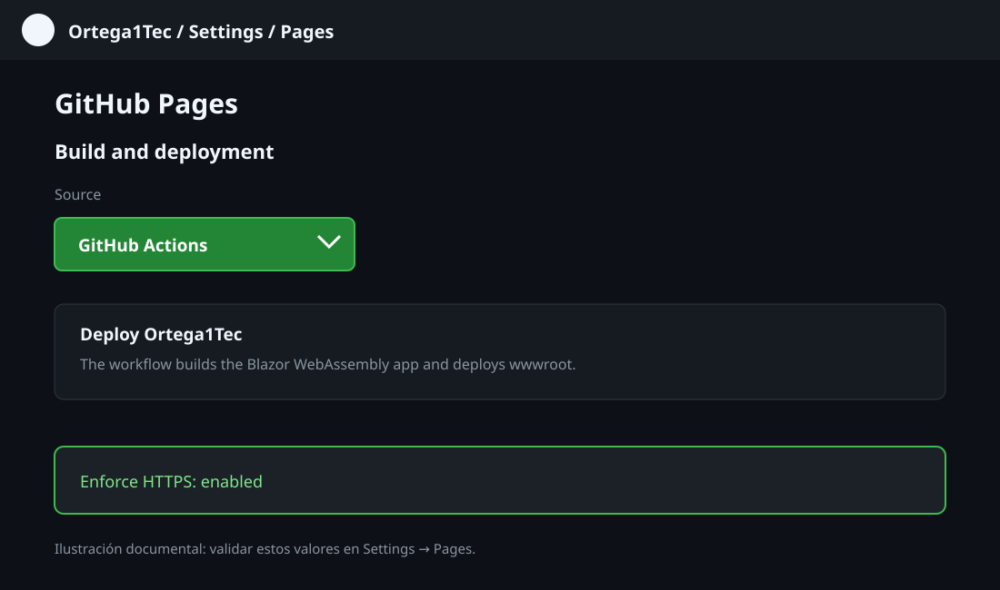
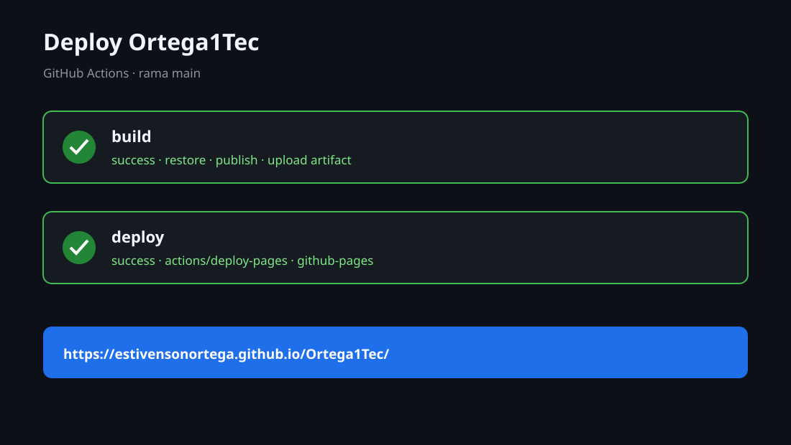
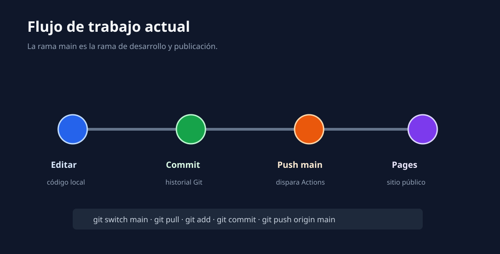

# Manual de Ortega1Tec

Guía de desarrollo, ejecución local y publicación de Ortega1Tec con .NET 11 RC, Blazor WebAssembly, una biblioteca Razor de componentes y GitHub Pages.

> Estado documentado: rama `main`, publicación automática activa y sitio disponible en [estivensonortega.github.io/Ortega1Tec](https://estivensonortega.github.io/Ortega1Tec/).

## 1. Resumen

Ortega1Tec es un sitio estático construido con Blazor WebAssembly. La aplicación se ejecuta en el navegador y se publica como archivos estáticos, por lo que GitHub Pages puede alojarla sin un servidor ASP.NET Core en producción.

La solución separa la aplicación de los componentes reutilizables:

- `Ortega1Tec.Web`: aplicación Blazor WebAssembly y punto de publicación.
- `Ortega1Tec.Components`: biblioteca Razor para componentes y recursos compartidos.
- `.github/workflows/deploy.yml`: compilación y despliegue automático.
- `global.json`: fija la versión exacta del SDK de .NET 11 RC.



## 2. Requisitos

- Windows, macOS o Linux.
- Git.
- SDK de .NET `11.0.100-rc.1.26425.128`.
- Un repositorio de GitHub con Pages habilitado.
- Acceso de escritura al repositorio para publicar cambios.

### Comprobar el SDK

Desde la raíz del repositorio:

```powershell
dotnet --version
```

El resultado esperado es:

```text
11.0.100-rc.1.26425.128
```

El archivo [global.json](../global.json) evita que el proyecto utilice accidentalmente otro SDK instalado.

> .NET 11 RC es una versión preliminar. Para producción conviene migrar a una versión estable cuando esté disponible y actualizar el `TargetFramework`, los paquetes y el workflow juntos.

## 3. Estructura del repositorio

```text
Ortega1Tec/
├── .github/
│   └── workflows/
│       └── deploy.yml
├── docs/
│   ├── manual-Ortega1Tec.md
│   └── images/
├── src/
│   ├── Ortega1Tec.Components/
│   │   ├── Ortega1Tec.Components.csproj
│   │   ├── Component1.razor
│   │   └── wwwroot/
│   └── Ortega1Tec.Web/
│       ├── Ortega1Tec.Web.csproj
│       ├── Program.cs
│       ├── Pages/
│       ├── Layout/
│       └── wwwroot/
├── global.json
├── Ortega1Tec.slnx
└── .gitignore
```

La aplicación WebAssembly referencia la biblioteca de componentes. Cuando se publica, los recursos estáticos de la biblioteca quedan disponibles bajo `_content/Ortega1Tec.Components/`.

## 4. Crear o restaurar la solución

La solución existente se puede restaurar con:

```powershell
dotnet restore Ortega1Tec.slnx
```

Para crear una solución equivalente desde cero:

```powershell
dotnet new sln -n Ortega1Tec
dotnet new blazorwasm -f net11.0 -n Ortega1Tec.Web -o src/Ortega1Tec.Web
dotnet new razorclasslib -f net11.0 -n Ortega1Tec.Components -o src/Ortega1Tec.Components
dotnet sln Ortega1Tec.slnx add src/Ortega1Tec.Web/Ortega1Tec.Web.csproj
dotnet sln Ortega1Tec.slnx add src/Ortega1Tec.Components/Ortega1Tec.Components.csproj
dotnet add src/Ortega1Tec.Web/Ortega1Tec.Web.csproj reference src/Ortega1Tec.Components/Ortega1Tec.Components.csproj
```

El SDK 11 puede generar una solución con extensión `.slnx`. Se debe utilizar el mismo nombre en los comandos de `restore`, `build` y GitHub Actions.

## 5. Ejecutar localmente

### HTTP

```powershell
dotnet run --project src/Ortega1Tec.Web/Ortega1Tec.Web.csproj --launch-profile http
```

Abrir:

[http://localhost:5029/](http://localhost:5029/)

### HTTPS

```powershell
dotnet run --project src/Ortega1Tec.Web/Ortega1Tec.Web.csproj --launch-profile https
```

Abrir:

[https://localhost:7140/](https://localhost:7140/)

El perfil HTTPS también puede escuchar en el puerto HTTP `5029` como dirección auxiliar. El certificado es de desarrollo y solo debe confiarse localmente.

Para detener el servidor:

```text
Ctrl+C
```

### Diferencia entre local y GitHub Pages

En desarrollo, [index.html](../src/Ortega1Tec.Web/wwwroot/index.html) usa:

```html
<base href="/" />
```

GitHub Pages publica el repositorio bajo `/Ortega1Tec/`. El workflow cambia la base del HTML publicado a:

```html
<base href="/Ortega1Tec/" />
```

Esta separación es necesaria. Si se usa `/Ortega1Tec/` localmente, Blazor buscará `_framework` en una ruta que el servidor local no expone.

## 6. Compilar y publicar localmente

Validar la solución:

```powershell
dotnet build Ortega1Tec.slnx -c Release --no-restore
```

Generar una publicación estática:

```powershell
dotnet publish src/Ortega1Tec.Web/Ortega1Tec.Web.csproj `
  -c Release `
  -o artifacts/pages `
  --no-restore
```

El resultado debe contener:

```text
artifacts/pages/
└── wwwroot/
    ├── _content/
    ├── _framework/
    ├── index.html
    └── ...
```

La carpeta `_content/Ortega1Tec.Components/` confirma que los recursos de la biblioteca viajaron con la aplicación.

## 7. Configurar GitHub Pages

En el repositorio de GitHub:

1. Abrir **Settings**.
2. Entrar en **Pages**.
3. En **Build and deployment**, seleccionar **GitHub Actions** como **Source**.
4. Mantener vacío **Custom domain** si no existe un dominio propio.
5. Mantener activado **Enforce HTTPS**.



No se debe seleccionar `Deploy from a branch` para este proyecto. Esa opción no ejecutaría `dotnet publish` y no generaría correctamente los archivos WebAssembly.

El entorno `github-pages` debe permitir la rama `main` si tiene una política de ramas personalizada:

```text
Settings > Environments > github-pages
> Deployment branches and tags > main
```

## 8. GitHub Actions

El workflow [deploy.yml](../.github/workflows/deploy.yml) se activa con cada `push` a `main` y también permite ejecución manual mediante `workflow_dispatch`.

El pipeline realiza estas operaciones:

1. Descarga el repositorio.
2. Configura GitHub Pages.
3. Instala el SDK exacto de .NET 11 RC.
4. Restaura la solución.
5. Publica `Ortega1Tec.Web` en modo Release.
6. Cambia la base URL para el subdirectorio del repositorio.
7. Crea `.nojekyll`.
8. Copia `index.html` como `404.html` para soportar rutas internas.
9. Sube el contenido de `wwwroot` como artefacto.
10. Despliega el artefacto con `actions/deploy-pages`.



## 9. Trabajar directamente en main

La rama actual de trabajo y publicación es `main`:

```powershell
git switch main
git pull origin main
```

Después de realizar cambios:

```powershell
git status
git add .
git commit -m "Describe el cambio"
git push origin main
```

El `push` a `main` inicia automáticamente GitHub Actions.



## 10. Verificar un despliegue

### Desde GitHub

Abrir la pestaña **Actions** y seleccionar **Deploy Ortega1Tec**. Un despliegue correcto debe mostrar:

```text
build  success
deploy success
```

La última ejecución validada fue el run `34546261294`.

### Desde PowerShell

```powershell
$url = 'https://estivensonortega.github.io/Ortega1Tec/'
$response = Invoke-WebRequest -Uri $url -UseBasicParsing
$response.StatusCode
```

El resultado esperado es `200`.

La aplicación publicada está disponible en:

[https://estivensonortega.github.io/Ortega1Tec/](https://estivensonortega.github.io/Ortega1Tec/)

## 11. Problemas frecuentes

### Aparece `An unhandled error has occurred`

Comprobar la URL base:

- Local: `<base href="/" />`
- GitHub Pages: `<base href="/Ortega1Tec/" />`

También comprobar que `_framework` responde desde la misma base.

### `Configurar GitHub Pages` falla con `Not Found`

Pages todavía no estaba habilitado. Entrar en **Settings > Pages** y seleccionar **GitHub Actions** como fuente.

### `deploy` falla, pero `build` funciona

Revisar el entorno `github-pages`. Si tiene una política de ramas personalizada, agregar `main` en **Deployment branches and tags**.

### La compilación local funciona, pero Pages no carga

Revisar que el workflow publique `release/wwwroot`, que cree `404.html` y que cambie la base URL a `/Ortega1Tec/`.

### Se usa el SDK equivocado

Ejecutar:

```powershell
dotnet --version
dotnet --info
```

El archivo `global.json` debe estar en la raíz desde la que se ejecutan los comandos.

## 12. Historial de cambios importantes

| Commit | Descripción |
| --- | --- |
| `c6d505f` | Crea la solución Blazor WebAssembly y la biblioteca de componentes. |
| `a268c26` | Permite la habilitación de GitHub Pages desde el workflow. |
| `d81f3c9` | Cambia la publicación automática de `develop` a `main`. |
| `a187d5e` | Fusiona `develop` en `main`. |

## 13. Próximos pasos recomendados

- Reemplazar las páginas de ejemplo por el contenido de Ortega1Tec.
- Crear componentes reutilizables dentro de `Ortega1Tec.Components`.
- Agregar pruebas para componentes y navegación.
- Migrar desde .NET 11 RC a una versión estable cuando corresponda.
- Considerar un dominio personalizado para la página pública.
- Mantener el manual actualizado cuando cambien la arquitectura o el workflow.
